# Tugas Besar Android - IF3210

## Kelompok
| NIM | Nama |
| --- | ---- |
| 13521004 | Henry Anand Septian Radityo |
| 13521007 | Matthew Mahendra |
| 13521024 | Ahmad Nadil |

## Fitur Aplikasi Bondoman
### Login
Pengguna login menggunakan credential yang telah diberikan. Login dilakukan ke backend https://pbd-backend-2024.vercel.app/.

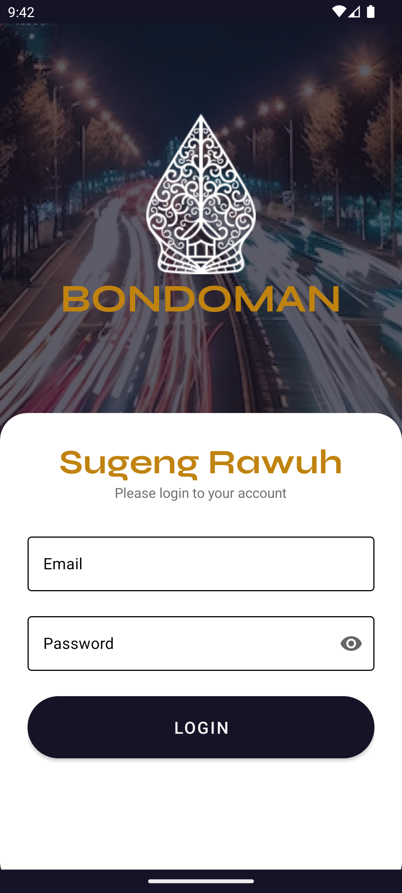

### Transactions
Layar daftar transaksi yang dapat dilakukan. Pengguna juga dapat menambahkan, mengubah, dan menghapus transaksi.

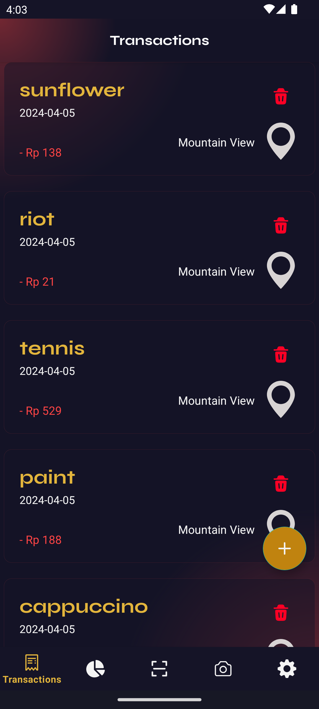
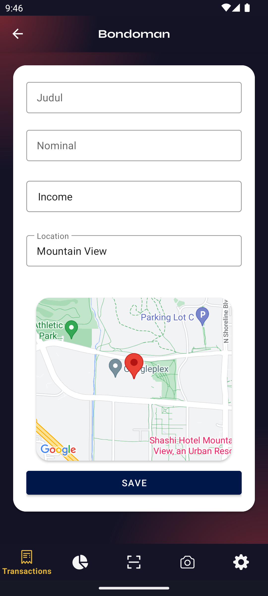
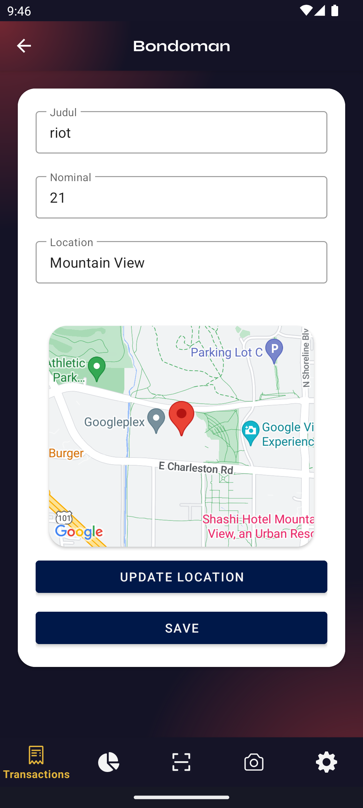

### Graph
Summary dari transaksi yang dilakukan, dibagi menurut kategori income/outcome.

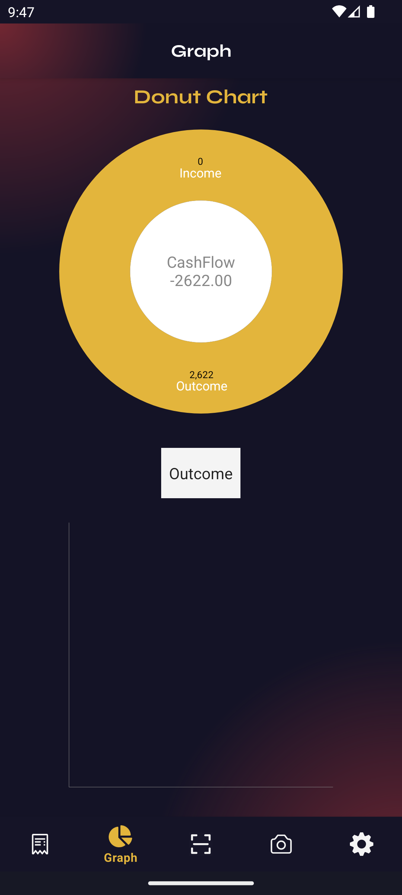


### Scan Nota
Melakukan scan nota untuk mengembalikan item-item yang terdapat pada nota. Scan dilakukan menggunakan kamera.

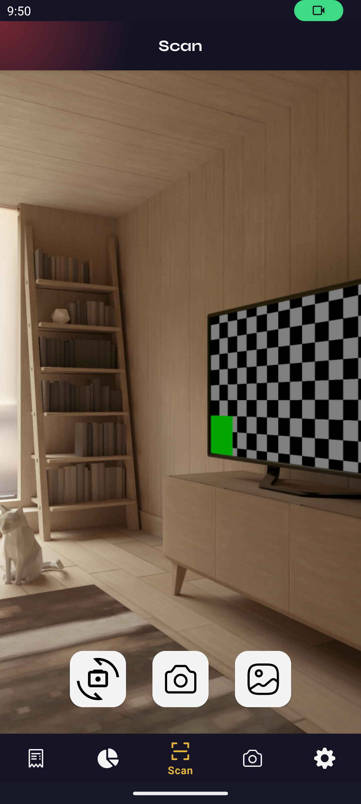
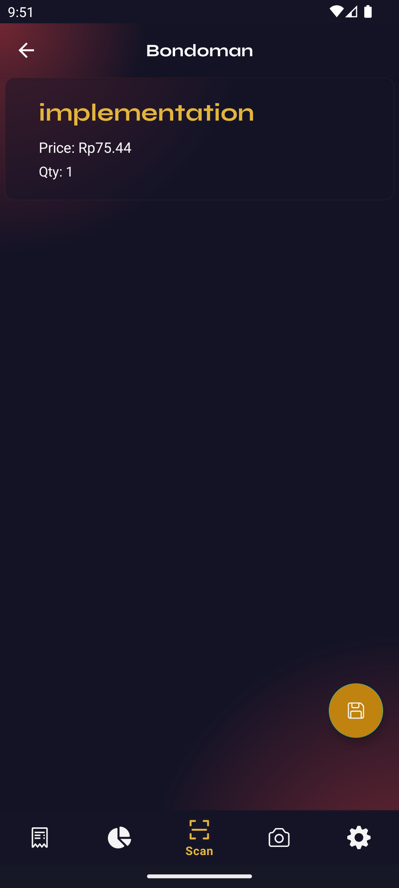

### Settings
Halaman pengaturan untuk mengunduh dan mengirim daftar transaksi, logout, dan melakukan randomize pada parameter transaksi.

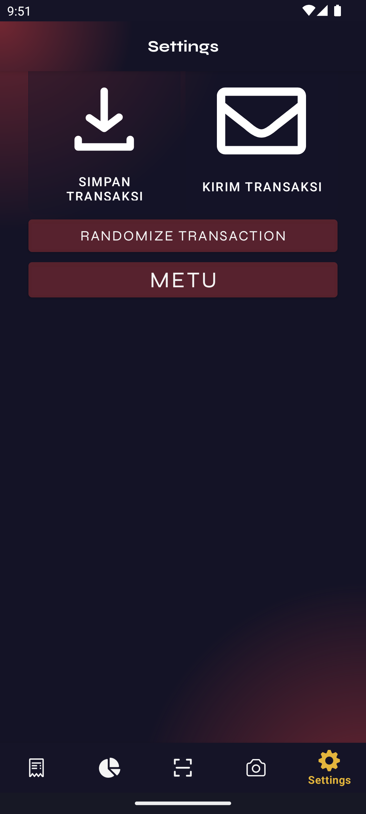

### Twibbon
Twibbon sederhana untuk mengingatkan apa yang terjadi ketika gagal membuat 1000 candi dalam satu malam.

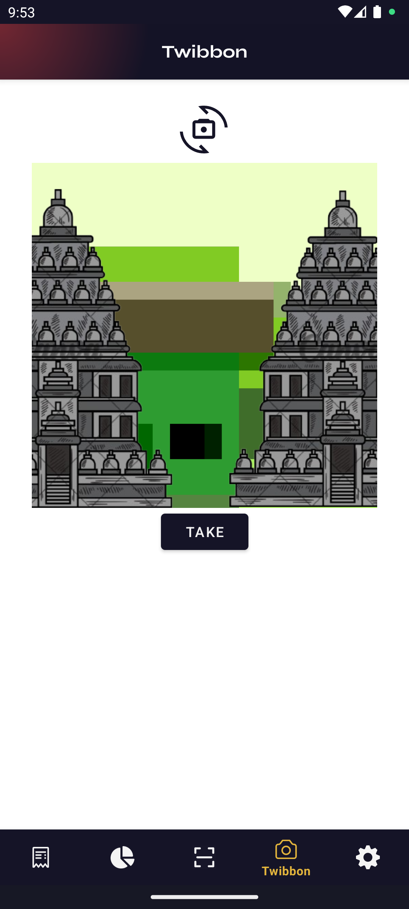

## Analisis OWASP
### M4: Insufficient Input/Output Validation
Security vulnerability ini terdapat pada input yang dilakukan pada aplikasi oleh user. Input dapat mempengaruhi kinerja dan keamanan dari aplikasi. Secara kinerja, aplikasi dapat mengalami crash ketika input yang diberikan tidak cukup atau terdapat value null yang digunakan maupun ketika menghasilkan output null. Selain itu, unvalidated input dapat menjadi penyebab serangan SQL Injection dengan memasukkan bagian dari query yang akan selalu bernilai true pada klausa WHERE.

Aplikasi yang dibuat memeriksa segala input pengguna agar tidak dibiarkan null atau memberikan default value jika hasilnya adalah null. Selain itu, terkait keamanan database, digunakan Room Persistence library. Room Persistence Library akan memastikan bahwa parameter yang diterima untuk digunakan dalam query divalidasi terlebih dahulu, misalnya sebagai string atau sebagai integer. Dengan demikian, jika ada query dengan parameter a OR 1=1, maka akan dianggap sebagai sebuah string secara keseluruhan. 

Diberikan gambar contoh input validation dan snippet penggunaan DAO.

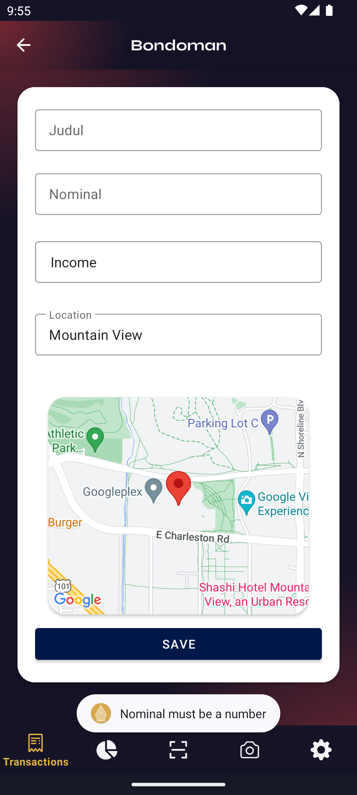

```
@Entity(tableName = "transactions")
data class Transaction(
    @PrimaryKey(autoGenerate = true) val transaction_id: Int?,
    @ColumnInfo(name = "transaction_owner") val transaction_owner: String,
    @ColumnInfo(name = "transaction_name") val transaction_name: String,
    @ColumnInfo(name = "transaction_date") val transaction_date: String,
    @ColumnInfo(name = "transaction_price") val transaction_price: Int,
    @ColumnInfo(name = "transaction_category") val transaction_category: String,
    @ColumnInfo(name = "transaction_location") val transaction_location: String,
    @ColumnInfo(name = "transaction_latitude") val transaction_latitude: Double,
    @ColumnInfo(name = "transaction_longitude") val transaction_longitude: Double
)

data class TransactionSummary(
    val transaction_date: String,
    val total_price: Float
)

@Dao
interface TransactionDao {
    @Query("SELECT * FROM transactions WHERE transaction_owner = :email ORDER BY transaction_date DESC")
    suspend fun index(email: String): List<Transaction>

    @Insert
    suspend fun store(vararg transaction: Transaction)

    @Update
    suspend fun update(transaction: Transaction)

    @Query("SELECT * FROM transactions WHERE transaction_id = :transactionId")
    suspend fun getTransactionById(transactionId: Int): Transaction?

    @Delete
    suspend fun delete(vararg transaction: Transaction)

    @Query("SELECT transaction_date, SUM(transaction_price) AS total_price FROM transactions WHERE transaction_owner = :email AND transaction_category = :category GROUP BY transaction_date ORDER BY transaction_date DESC LIMIT 7")
    suspend fun getLast7Transaction(email: String, category: String): List<TransactionSummary>
}
```

### M8: Security Misconfiguration
Konfigurasi yang diberikan di aplikasi, pada AndroidManifest.xml, dapat memberikan vulnerability dalam bentuk akses yang tidak terautentikasi terhadap data-data sensitif di aplikasi. Contoh dari penyebab ini adalah tidak mereviu kembali permission yang didefinisikan di manifest maupun tidak melakukan enkripsi terhadap data sensitif seperti API Key atau password.

Pada aplikasi yang dibuat, penyimpanan password untuk keperluan JWT dienkripsi menggunakan Android Keystore sehingga tidak langsung menyimpan password begitu saja. Terkait intent ke aplikasi lain, data yang dikirimkan ke intent aplikasi lain yaitu GMap hanya sebagian data yang diperlukan saja yaitu data latitude dan longitude, sehingga tidak ada data lain yang dikirimkan keluar aplikasi yang mungkin dapat menjadi security breach. Begitu pula untuk broadcast. Broadcast pada randomize transaction hanya mengirimkan broadcast secara internal sehingga tidak diterima oleh aplikasi dari luar. Terkait permission yang didefinisikan aplikasi hanya memerlukan permission lokasi, camera, write to storage, dan internet. Dengan demikian hanya permission itu saja yang didefinisikan di android manifest sehingga tidak ada permission yang tidak diperlukan dicantumkan.

Diberikan snippet permission pada AndroidManifest.xml dan enkripsi password dan username untuk JWT
```
<uses-permission android:name="android.permission.INTERNET"/>
<uses-permission android:name="android.permission.ACCESS_NETWORK_STATE"/>
<uses-permission android:name="android.permission.CHANGE_NETWORK_STATE"/>
<uses-permission android:name="android.permission.CAMERA"/>
<uses-permission android:name="android.permission.ACCESS_COARSE_LOCATION"/>
<uses-permission android:name="android.permission.ACCESS_FINE_LOCATION"/>
<uses-permission
    android:name="android.permission.WRITE_EXTERNAL_STORAGE"
    android:maxSdkVersion="18" />
```

```
KeyStoreManager.getInstance(this@LoginActivity).createNewKeys("token")
KeyStoreManager.getInstance(this@LoginActivity).createNewKeys("email")
KeyStoreManager.getInstance(this@LoginActivity).createNewKeys("password")
KeyStoreManager.getInstance(this@LoginActivity).createNewKeys("expiry")
```

### M9: Insecure Data Storage
Vulnerability ini mencoba untuk mengakses data sensitif yang seharusnya tidak dapat diakses oleh umum. Hal yang diincar adalah enkripsi yang lemah, tidak menghandle user credential dengan tepat, dan penyimpanan data yang kurang secure. Hal-hal tersebut dapat dicapai melalui logging yang tidak benar, tidak menghapus temporary file, menyimpan password dalam plainteks, dll.

Pada aplikasi yang dibuat, pada saat membuat file export transaction, temporary file akan dihapus pada saat file sudah disimpan di direktori yang diinginkan (folder download). Pada awalnya access-token dan expire timenya dilog ke aplikasi, namun telah dihapus karena pada awalnya digunakan untuk debugging pada saat pembuatan. Untuk keperluan penyimpanan token login, disimpan dengan melakukan enkripsi dengan RSA.

Diberikan snippet sebagai penghapusan file dan enkripsi RSA sebagai berikut:
```
val tempFile = kotlin.io.path.createTempFile("test_output_", type)
workbook.write(tempFile.outputStream())
workbook.close()
val downloadFolder = Environment.getExternalStoragePublicDirectory(Environment.DIRECTORY_DOWNLOADS)
val dateFormat = SimpleDateFormat("yyyyMMdd_HHmmss", Locale.getDefault())
val dateSignature = dateFormat.format(Date())
val fileName = "transactions_${dateSignature}$type"
val targetFile = File(downloadFolder, fileName)
if (flag==1){
    tempFile.toFile().copyTo(targetFile, overwrite = true)
    tempFile.toFile().delete()
} else {
    val newFileName = "Transaction_${dateSignature}$type"
    val newFilePath = tempFile.resolveSibling(newFileName)
    Files.move(tempFile, newFilePath, StandardCopyOption.REPLACE_EXISTING)
    return newFilePath.toAbsolutePath().toString()
}
```

```
private fun encryptData(alias: String, token: String): String {
    val publicKey = keyStore.getCertificate(alias).publicKey

    val cipher = Cipher.getInstance("RSA/ECB/PKCS1Padding").apply {
        init(Cipher.ENCRYPT_MODE, publicKey)
    }

    val bytes = token.toByteArray(Charsets.UTF_8)
    val encryptedBytes = cipher.doFinal(bytes)
    return Base64.encodeToString(encryptedBytes, Base64.DEFAULT)
}
```

## Accessability Testing
Setelah dilakukan accessability testing, didapatkan hasil sebagai berikut untuk setiap halaman

### Suggestion Login
Sebagian besar mempermasalahkan text contrast dari elemen-elemen yang ada pada halaman Login

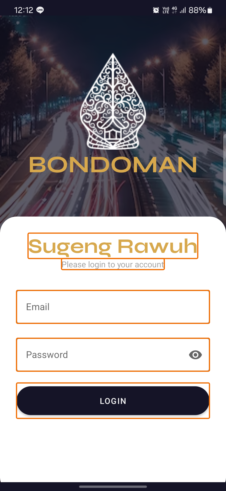

### Suggestion Add Transaction
Dipermasalahkan ukuran input yang statik dari teks dan elemen.

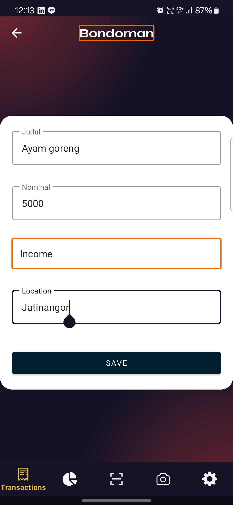


### Suggestion Scan Result
Dipermasalahkan ukuran yang statik sehingga tidak bisa discale pada layar yang berbeda.

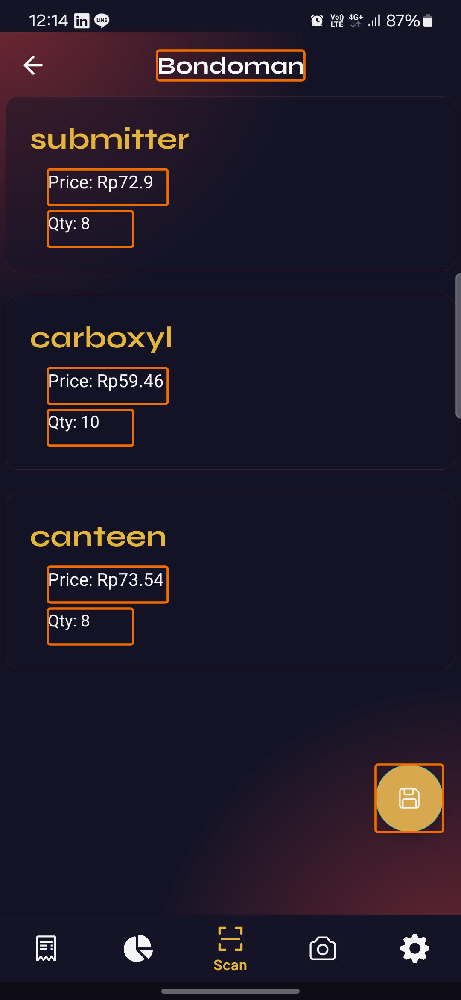

### Suggestion Update Transaction
Dipermasalahkan touch size yang terlalu kecil untuk elemen yang ada dalam layar.

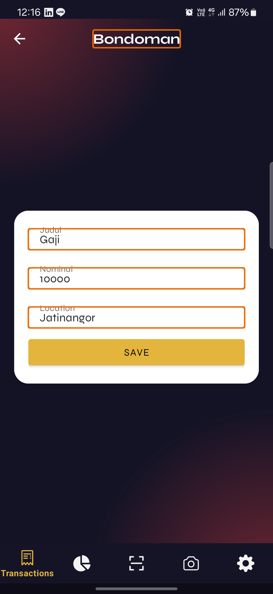

### Suggestion Graph
Dipermasalahkan ukuran yang statik sehingga tidak bisa discale pada layar yang berbeda dan id yang sama.

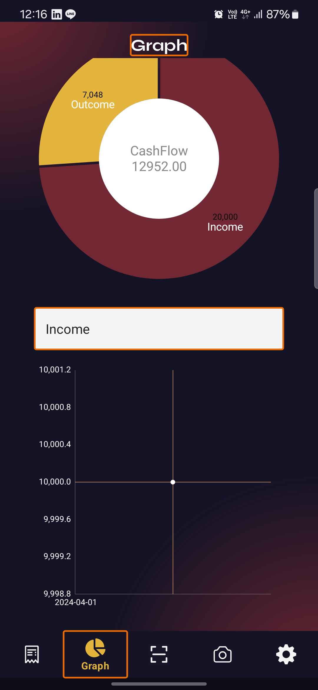

### Suggestion Scan
Dipermasalahkan ukuran yang statik sehingga tidak bisa discale pada layar yang berbeda dan id yang sama. Terdapat juga masalah kontras pada judul layar.

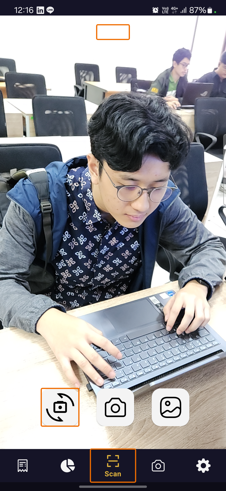

### Suggestion Twibbon
Dipermasalahkan elemen yang ukurannya statik, kontras warna, dan id elemen yang sama untuk beberapa elemen lainnya.

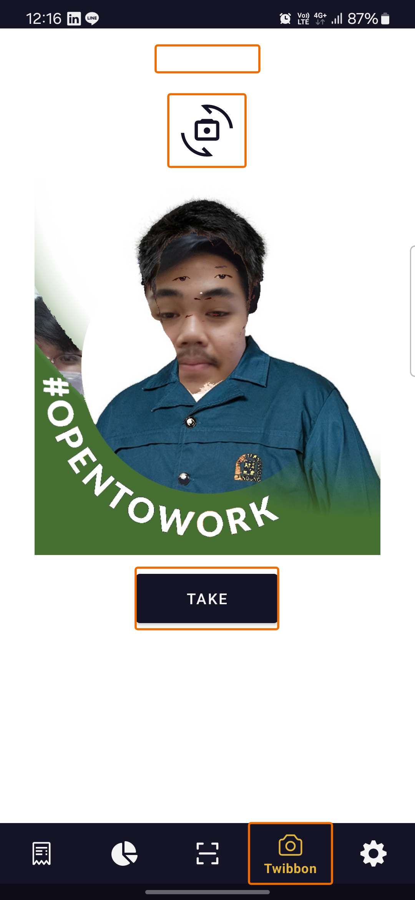

### Suggestion Setting
Pada umumnya dipermasalahkan elemen yang ukurannya statik sehingga tidak dapat dilakukan scaling pada layar dengan ukuran yang bermacam-macam.

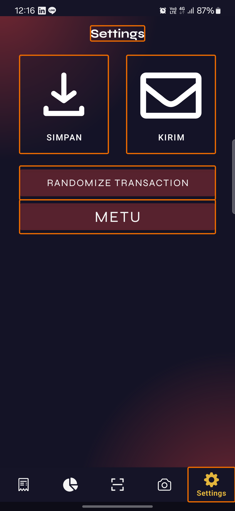

### Suggestion Transaction
Dipermasalahkan ukuran touch target, tidak adanya alt-text pada tombol delete, value yang sama untuk beberapa elemen lainnya, dan kontras warna.

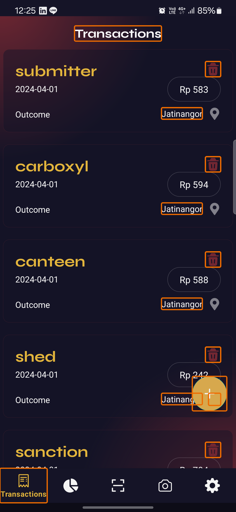

## Alokasi Waktu
| NIM | Waktu Persiapan (Jam) | Waktu Pengerjaan (Jam) |
| --- | --------------------- | ---------------------- |
| 13521004 |5| 24 |
| 13521007 |5| 24 |
| 13521024 |5| 24 |